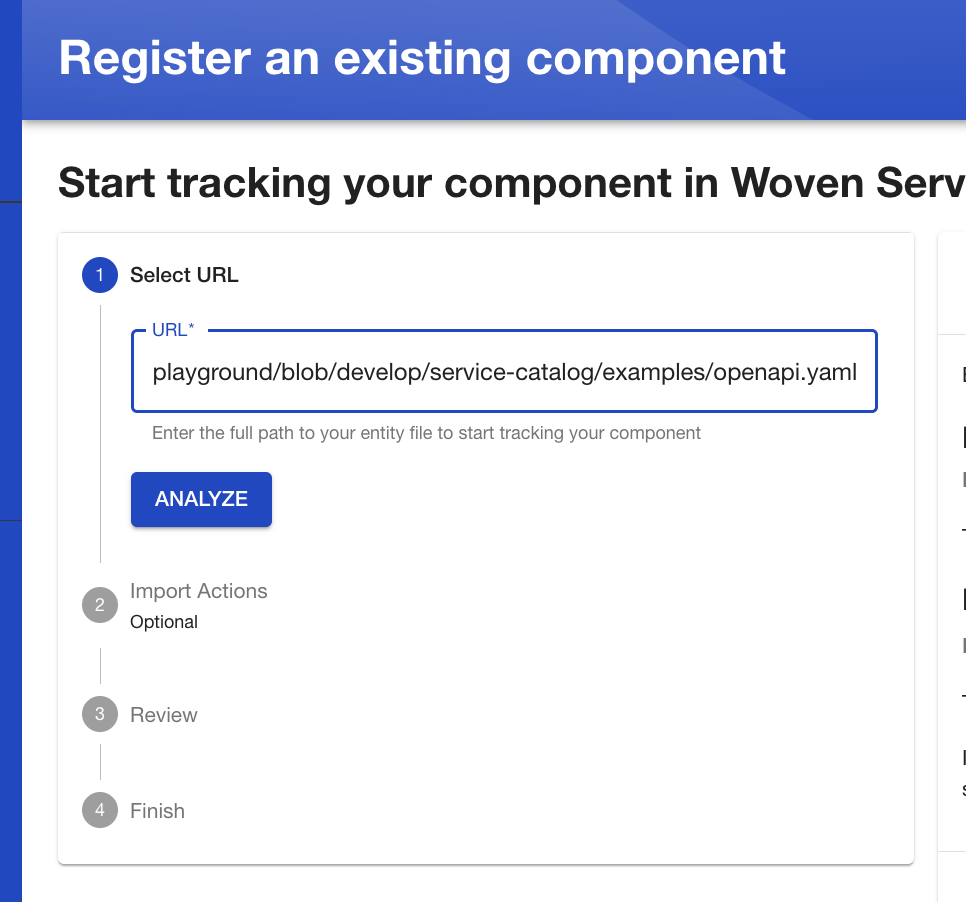
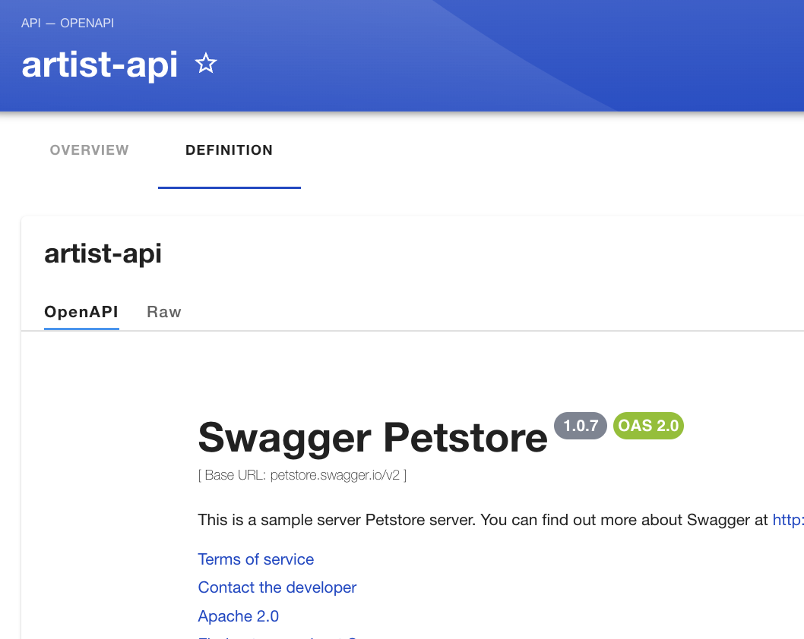

# Create API catalog 

## Setting Authentication with Github and sign in 
If you have already set the authentication, go to next step.
https://www.youtube.com/watch?v=hhopHFT4J_o

* Add auth to the app-config.yaml. if you use local environment, add github Client Id and secret to the app-config.local.yaml.

https://backstage.io/docs/auth/github/provider#configuration

* Backend setting

https://backstage.io/docs/auth/github/provider#backend-installation

* Add custom function for github 

https://backstage.io/docs/auth/identity-resolver#custom-ownership-resolution

https://backstage.io/docs/auth/identity-resolver#sign-in-without-users-in-the-catalog

** if email = undefined, add the below to app-config.yaml
```
auth:
  environment: development
  providers:
    github:
      development:
        clientId: ${GITHUB_CLIENT_ID}
        clientSecret: ${GITHUB_CLIENT_SECRET}
        scope: 'read:user user:email' //add this line
```

## Getting started

### Connect with github by PAT
Before setting catalog, connect with github. Backstage read yaml file from github.

* To create a Personal Access Token, go to your Github settings, add a name, and set an expiration date of your preference.

** if the repository is private, you need to add check to the repo when you generate token at Github.

* Click on “Generate Token”, and take note of the details in a safe place.


* Open your app-config.local.yaml, and add the credentials for your token as pictured below:
```
integrations:
  github:
    - host: github.com
      token: ghp_YOURTOKEN
```
Reference: https://www.youtube.com/watch?v=U5V-rJQ8vJg

** if you cannot register catalog.yaml file by create new component, check if the github repository is private.

### Register YAML file URL of Github to Backstage
Reference: https://www.youtube.com/watch?v=_gj9PxQo4i0

 Once you have a YAML file in your repository and have enabled the GitHub integration in your Backstage instance, you’re ready to register a component in the Catalog. Register yaml file of github to Backstage’s UI.

* Click on "REGISTER EXISTING COMPONENT" in the top right corner. You’ll be prompted to input the location of your component’s YAML file.

* Input the URL of your catalog-info.yaml file of github(ex. https://github.com/wcm-wig-lab/service-catalog-playground/blob/develop/service-catalog/examples/openapi.yaml). Click on Analyze.



** if you get error to connect with swagger set like this in app-config.yaml:
```
backend:
  reading:
    allow:
      - host: petstore.swagger.io // remove http://
```

Run yarn dev and see if swagger API can be seen in the screen. 


* reference
https://trainingportal.linuxfoundation.org/learn/course/introduction-to-backstage-developer-portals-made-easy-lfs142/welcome-to-lfs142/course-information?page=1

-----------------------------------------------------------------------------------
### Add pagination to the catalog list
https://backstage.io/docs/features/software-catalog/catalog-customization#pagination

### What is Entity
https://backstage.io/docs/features/software-catalog/creating-the-catalog-graph#descriptor-components-used-to-build-the-catalog-graph

### Add plugin
https://backstage.io/docs/plugins/create-a-plugin#create-a-plugin

https://backstage.io/docs/plugins/composability#extensions-from-a-plugins-point-of-view
