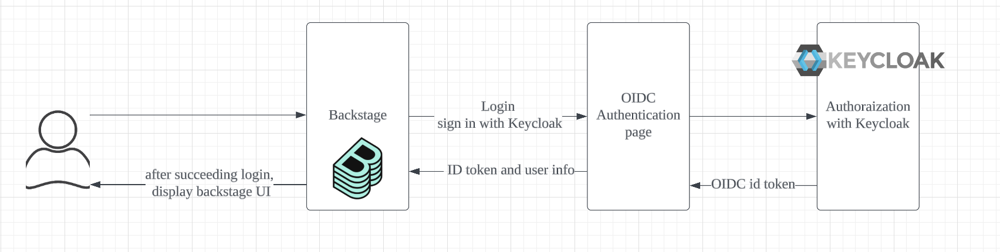
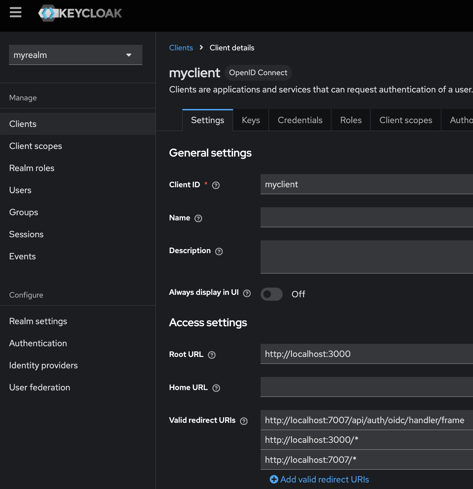
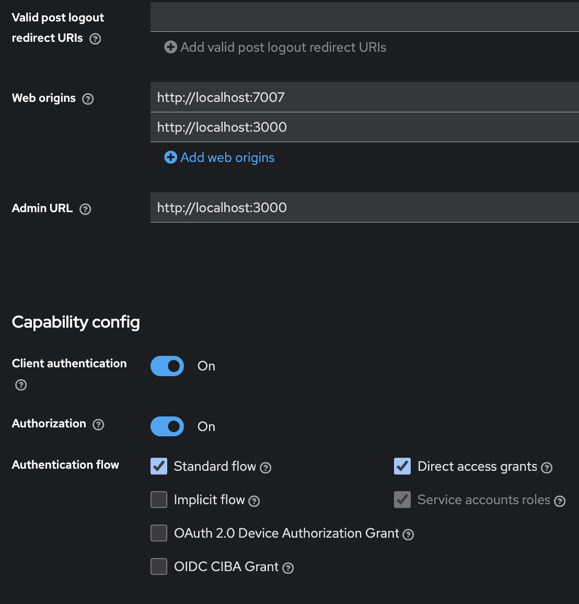
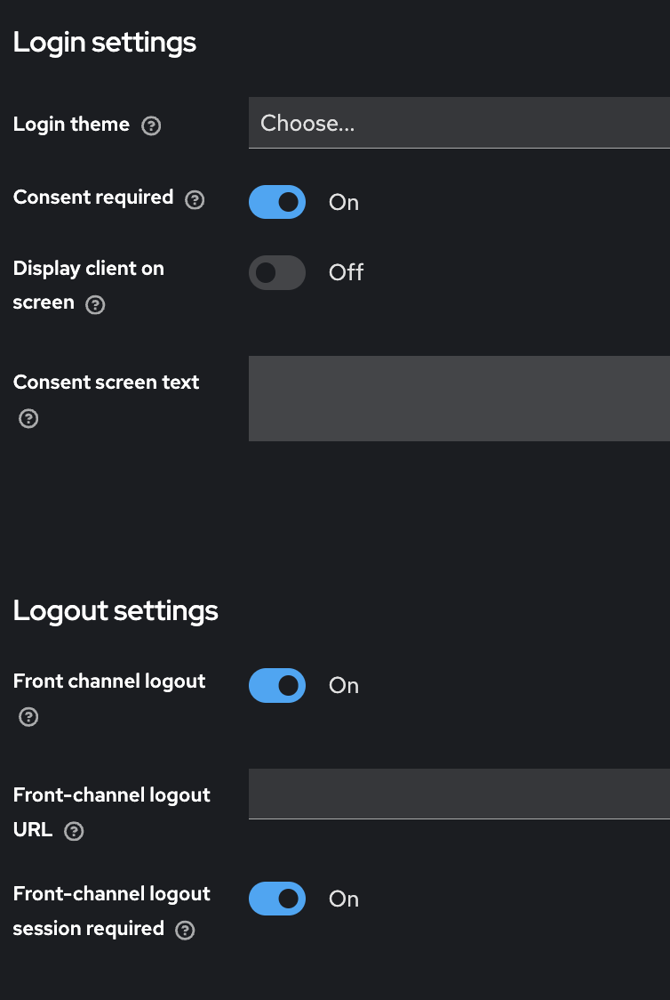
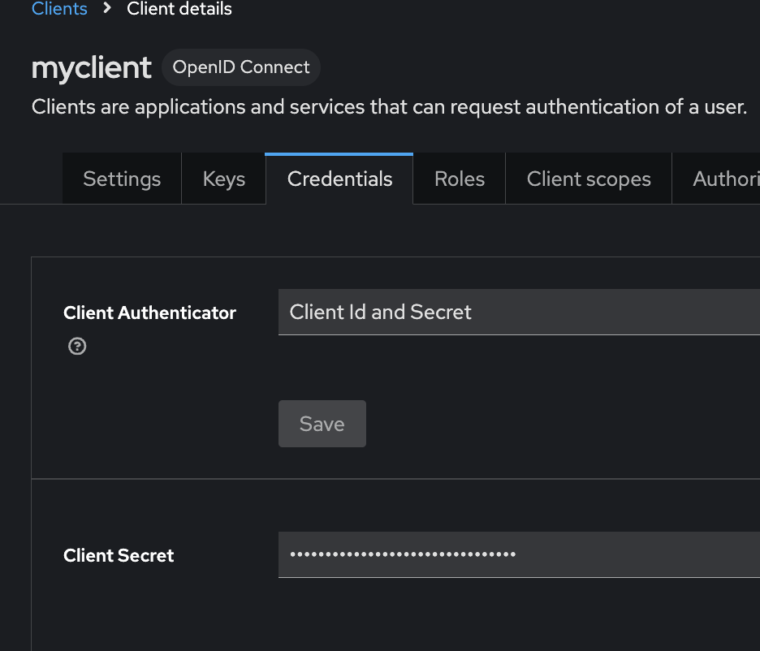
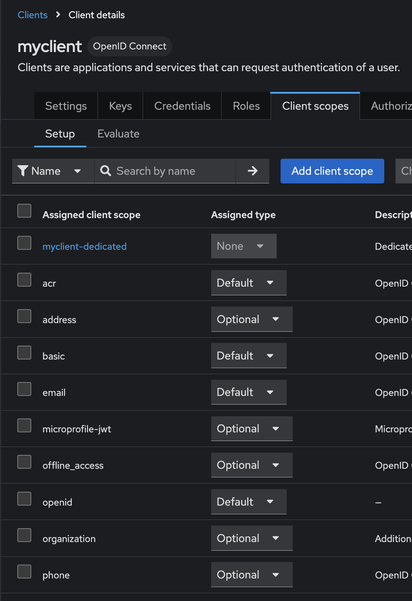

# Keycloak configuration with backstage

** use node version 18
```
nvm use 18
```
## Architecture
keycloak is not supported by the backstage. It needs to connect through oidc.

You need to create a clientId and client secret at Keycloak and set it to app-config.yaml.

You need to add a custom function to checking if oidc provider is matching the value returned from keycloak.




## Setting app-config.yaml
/my-app/app-config.yaml

** clientId, clientSecret, and matadataUrl need to match to keycloak.
```
auth:
  session:
    secret: ${SESSION_SECRET}
  environment: development
  providers:
    oidc:
      development:
        metadataUrl: ${AUTH_REALM_URL}/.well-known/openid-configuration
        clientId: ${AUTH_MY_CLIENT_ID}
        clientSecret: ${AUTH_MY_CLIENT_SECRET}
        scopes: "openid profile email"
```
* generate session.secret by node.js, run this at terminal
```
node -e "console.log(require('crypto').randomBytes(32).toString('hex'))"
```

## Setting UI for OIDC at App.tsx
/my-app/packages/app/src/App.tsx

This part will be the UI of login window.
```
  components: {
    SignInPage: props => (
      <SignInPage
        {...props}
        auto
        providers={[
          {
            id: 'oidc', //this need to match to auth.providers at app-config.yaml
            title: 'oidc Login',
            message: 'Sign in using oidc',
            apiRef: oidcAuthApiRef,
          },
        ]}
      />
    ),
  },
```

## Setting api.ts
/my-app/packages/app/src/apis.ts

this function create fetches to keycloak.
```
import {
  AnyApiFactory,
  ApiRef,
  BackstageIdentityApi,
  configApiRef,
  createApiFactory,
  createApiRef,
  discoveryApiRef,
  oauthRequestApiRef,
  OpenIdConnectApi,
  ProfileInfoApi,
  SessionApi,
} from '@backstage/core-plugin-api';
import { OAuth2 } from '@backstage/core-app-api';

export const oidcAuthApiRef: ApiRef<
  OpenIdConnectApi & // The OIDC API that will handle authentification
    ProfileInfoApi & // Profile API for requesting user profile info from the auth provider in question
    BackstageIdentityApi & // Backstage Identity API to handle and associate the user profile with backstage identity
    SessionApi // Sesssion API, to handle the session the user will have while logged in
> = createApiRef({
  id: 'oidc-provider', // Can be anything as long as it doesn't conflict with other API ref IDs
});

export const apis: AnyApiFactory[] = [
  createApiFactory({
    api: oidcAuthApiRef,
    deps: {
      discoveryApi: discoveryApiRef,
      oauthRequestApi: oauthRequestApiRef,
      configApi: configApiRef,
    },
    factory: ({ discoveryApi, oauthRequestApi, configApi }) =>
      OAuth2.create({
        configApi,
        discoveryApi,
        oauthRequestApi,
        provider: {
          id: 'oidc', //this need to match to auth.providers at app-config.yaml
          title: 'oidc',
          icon: () => null,
        },
        environment: configApi.getOptionalString('auth.environment'), //this comes from app-config.yaml
        defaultScopes: ['openid', 'profile', 'email'],
        popupOptions: {
          size: {
            width: 1000,
            height: 1000,
          },
        },
      }),
  }),
];
```

## Add auth setting
/my-app/packages/backend/src/modules/auths/authProvidersModule.ts

This function catches data from keycloak and check if it is oidc provider.
```
import {
  providers,
  defaultAuthProviderFactories,
  ProviderFactories,
} from '@backstage/plugin-auth-backend';
import {
  stringifyEntityRef,
  DEFAULT_NAMESPACE,
} from '@backstage/catalog-model';
import {
  AuthProviderFactory,
  AuthResolverContext,
  authProvidersExtensionPoint,
  createOAuthProviderFactory,
} from '@backstage/plugin-auth-node';
import {
  coreServices,
  createBackendModule,
} from '@backstage/backend-plugin-api';
import { oidcAuthenticator } from '@backstage/plugin-auth-backend-module-oidc-provider';

async function signInWithCatalogUserOptional(
  name: string,
  ctx: AuthResolverContext,
) {
  try {
    const signedInUser = await ctx.signInWithCatalogUser({
      entityRef: { name },
    });

    return Promise.resolve(signedInUser);
  } catch (e) {
    const userEntityRef = stringifyEntityRef({
      kind: 'User',
      name: name,
      namespace: DEFAULT_NAMESPACE,
    });

    return ctx.issueToken({
      claims: {
        sub: userEntityRef,
        ent: [userEntityRef],
      },
    });
  }
}

function getAuthProviderFactory(providerId: string): AuthProviderFactory {
  switch (providerId) {
    case 'oidc':
      return createOAuthProviderFactory({
        authenticator: oidcAuthenticator,
        async signInResolver({ profile }, ctx) {
          console.log('oidc called', ctx);
          if (!profile.email) {
            throw new Error(
              'Login failed, user profile does not contain an email',
            );
          }
          // Split the email into the local part and the domain.
          const [localPart, domain] = profile.email.split('@');

          // Next we verify the email domain. It is recommended to include this
          // kind of check if you don't look up the user in an external service.
          if (domain !== 'woven-planet.global') {
            throw new Error(
              `Login failed, '${profile.email}' does not belong to the expected domain`,
            );
          }

          // By using `stringifyEntityRef` we ensure that the reference is formatted correctly
          const userEntity = stringifyEntityRef({
            kind: 'User',
            name: localPart,
            namespace: DEFAULT_NAMESPACE,
          });
          return ctx.issueToken({
            claims: {
              sub: userEntity,
              ent: [userEntity],
            },
          });
        },
      });
    default:
      throw new Error(`No auth provider found for ${providerId}`);
  }
}

const authProvidersModule = createBackendModule({
  pluginId: 'auth',
  moduleId: 'auth.providers',
  register(reg) {
    reg.registerInit({
      deps: {
        config: coreServices.rootConfig,
        authProviders: authProvidersExtensionPoint,
        logger: coreServices.logger,
      },
      async init({ config, authProviders, logger }) {
        console.log('is it called?', authProviders);
        const providersConfig = config.getConfig('auth.providers');
        const authFactories: ProviderFactories = {};
        providersConfig
          .keys()
          .filter(key => key !== 'guest')
          .forEach(providerId => {
            const factory = getAuthProviderFactory(providerId);
            authFactories[providerId] = factory;
          });

        const providerFactories: ProviderFactories = {
          ...defaultAuthProviderFactories,
          ...authFactories,
        };

        logger.info(
          `Enabled Provider Factories : ${JSON.stringify(providerFactories)}`,
        );

        Object.entries(providerFactories).forEach(([providerId, factory]) => {
          authProviders.registerProvider({ providerId, factory });
        });
      },
    });
  },
});

export default authProvidersModule;
```

## Add auth setting to index.ts file on the backend

```
import * as dotenv from 'dotenv';
dotenv.config({ path: '../../.env' }); //add dotenv if you use .env file
import { createBackend } from '@backstage/backend-defaults';

const backend = createBackend();

// auth plugin
backend.add(import('@backstage/plugin-auth-backend'));
// See https://backstage.io/docs/backend-system/building-backends/migrating#the-auth-plugin
backend.add(import('@backstage/plugin-auth-backend-module-guest-provider'));
// See https://backstage.io/docs/auth/guest/provider

// backend.add(import('@backstage/plugin-auth-backend-module-oidc-provider'));

backend.add(import('./modules/auths/authProvidersModule'));
backend.start();
```

## Keycloak setting
** local setting

run keycloak locally with docker. create client

https://www.keycloak.org/getting-started/getting-started-docker

client setting



Root url: the URL where backstage running

valid redirect URLs: the URL where keycloak redirect after authenticated. usually to the backend. 



client authentication: it enable to generate client secret on credentials tab.





add client secret from here

** create openid scope from Client Scope page and add it to Client->myclient-> client scope tab



add openid for client scope


## Run application
```
yarn install
yarn dev
```